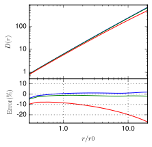

Atmospheric phase screen generator using a "woofer-tweeter" algorithm
======================================================================

This Python 3 module implements the algorithm described in a paper recently submitted to Optics Express. The algorithm superposes two phase screens containing high-frequency ("tweeter") and low-frequency ("woofer") perturbations.

The result can be seen in the figure below, where the structure function of the individual screens is compared to the theoretical structure function, and their sum is shown on the right. The sum clearly matches theoretical predictions to a high degree of accuracy.

