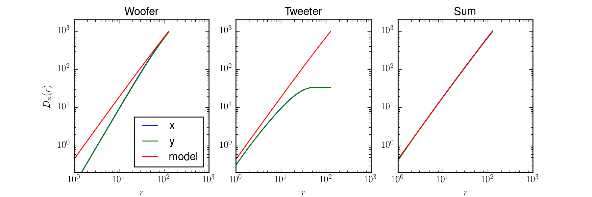

==============
 Introduction
==============

MegaScreen is a Python 3 package implementing the algorithm described in
[Buscher2016]_. This algorithm aims to simulate with high accuracy the wavefront perturbations arising from optical propagation through Kolmogorov turbulence. The abstract of the paper reads:

   We describe an algorithm for simulating atmospheric wavefront perturbations over ranges of spatial and temporal scales spanning more than 4 orders of magnitude.  An open-source implementation of the algorithm written in Python can simulate the evolution of the perturbations more than an order-of-magnitude faster than real time. Testing of the implementation using metrics appropriate to adaptive optics systems and long-baseline interferometers show accuracies at the few percent level or better.

The algorithm superposes two phase screens containing high-frequency ("tweeter") and low-frequency ("woofer") perturbations respectively. An example result can be seen in the figure below, where the x- and y-direction structure functions of the individual screens are compared to the theoretical structure function, and their sum is shown on the right. The sum clearly matches theoretical predictions to a high degree of accuracy.

The following sections describe how to install and use the `MegaScreen` package, starting from the simplest usage and moving on to more detailed explanations of how to choose parameters of the main `MegaScreen()` function call to suit different applications.

.. [Buscher2016] Buscher, D.F. “Simulating Large Atmospheric Phase Screens Using a Woofer-Tweeter Algorithm.” Optics Express 24, no. 20 (October 3, 2016): 23566–71. https://doi.org/10.1364/OE.24.023566.

